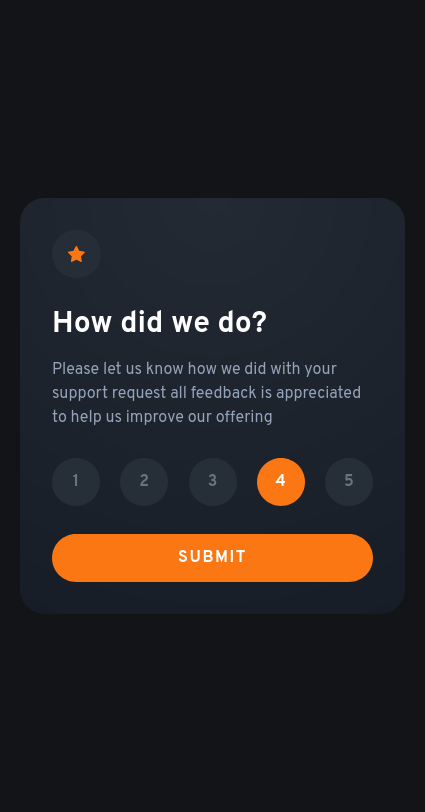
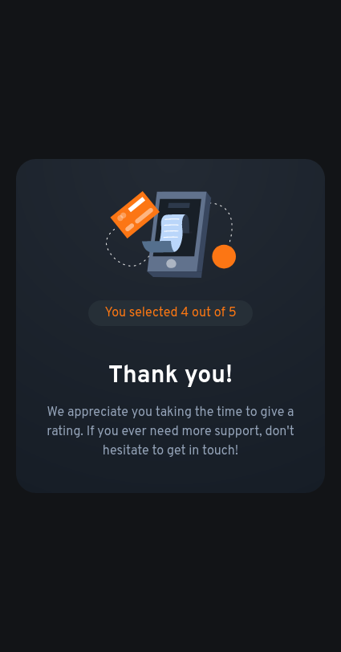

# Frontend Mentor - Interactive rating component solution

This is a solution to the [Interactive rating component challenge on Frontend Mentor](https://www.frontendmentor.io/challenges/interactive-rating-component-koxpeBUmI). Frontend Mentor challenges help you improve your coding skills by building realistic projects.

## Table of contents

- [Overview](#overview)
  - [The challenge](#the-challenge)
  - [Screenshot](#screenshot)
  - [Links](#links)
- [My process](#my-process)
  - [Built with](#built-with)
  - [What I learned](#what-i-learned)
  - [Continued development](#continued-development)
  - [Useful resources](#useful-resources)
- [Author](#author)
- [Acknowledgments](#acknowledgments)

## Overview

### The challenge

Users should be able to:

- View the optimal layout for the app depending on their device's screen size
- See hover states for all interactive elements on the page
- Select and submit a number rating
- See the "Thank you" card state after submitting a rating

### Screenshot

#### Desktop

#### Desktop Thank you

#### Mobile

#### Mobile Thank you

### Links

- Solution URL: [Interactive Rating Component](https://www.frontendmentor.io/solutions/interactive-rating-component-using-html-tailwindcss-and-js-iE_mRPtsFQ)
- Live Site URL: [GitHub Pages](https://deon-gracias.github.io/interactive-rating-component/)

## My process

### Built with

- Semantic HTML5 markup
- CSS custom properties
- Flexbox
- CSS Grid

## Author

- GitHub - [Deon Gracias](github.com/deon-gracias)
- Linkedin - [Deon Gracias](https://www.linkedin.com/in/deongracias)
- Frontend Mentor - [@Anonymous616](https://www.frontendmentor.io/profile/Anonymous616)
